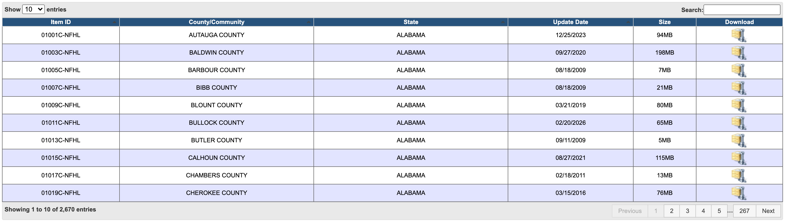
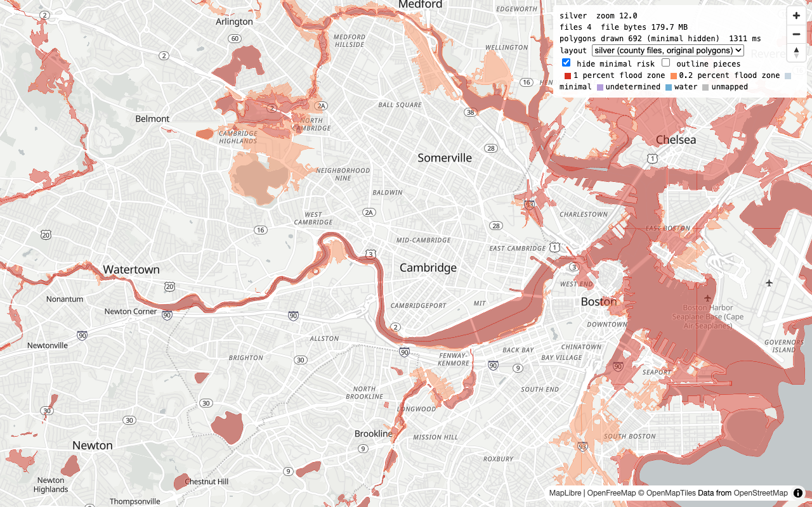

<!-- _class: lead -->
<!-- _paginate: false -->

# Make FEMA Flood Maps Cloud-Native

## A GeoParquet + DuckDB pipeline

Guillaume Sueur, Geomermaids
Cloud Native Geospatial Forum, October 2026

<!--
Script: modules/README.md (the spine) and modules/00_framing.md.
Every instruction gets four slides: why, example, mini-benchmark, what we have now.
-->

---

# The dataset

## FEMA's National Flood Hazard Layer, polygon layer `S_FLD_HAZ_AR`

- The official flood map of the United States. Zones decide insurance, disclosure and building rules
- One row is one polygon with one zone: `FLD_ZONE`, its `ZONE_SUBTY`, `SFHA_TF` (in the Special Flood Hazard Area, the 1 percent zone), `STATIC_BFE` (base flood elevation, feet), `DFIRM_ID`, `FLD_AR_ID`
- Delivered as per-county zipped shapefiles, one ZIP per county, downloaded from FEMA's Flood Map Service Center portal
  `https://hazards.fema.gov/femaportal/NFHL/searchResult`

<!-- modules/00_framing.md, Say, first paragraph -->

---
<!-- _footer: "" -->

<style scoped>section { font-size: 17px; } pre { font-size: 0.66em; } table { font-size: 0.72em; }</style>


# Flood zone types (`FLD_ZONE`)
## FEMA's definitions: annual chance of flooding, and how the study established it

| zone | meaning | SFHA | BFE |
|---|---|---|---|
| **A** | 1 percent annual chance, approximate study | yes | no |
| **AE**, **A1** to **A30** | 1 percent annual chance, detailed study | yes | yes |
| **AH** | 1 percent annual chance, shallow ponding, 1 to 3 ft | yes | yes |
| **AO** | 1 percent annual chance, shallow sheet flow, 1 to 3 ft | yes | depths shown |
| **A99** | 1 percent annual chance, federal protection system under construction | yes | no |
| **AR** | temporarily increased risk while a flood control system is restored | yes | varies |
| **V** | coastal 1 percent annual chance with wave action | yes | no |
| **VE**, **V1** to **V30** | coastal 1 percent annual chance with wave action, detailed study | yes | yes |
| **X** shaded | 0.2 percent annual chance and other moderate hazard areas | no | no |
| **X** unshaded | minimal hazard | no | no |
| **D** | flood hazard possible but undetermined, no analysis done | no | no |

`OPEN WATER` and `AREA NOT INCLUDED` also appear in `S_FLD_HAZ_AR`: placeholders for water bodies and unmapped communities, not hazard classes.

`nfhl normalize` collapses all of this into one `risk` column: `1 percent flood zone`, `0.2 percent flood zone`, `minimal`, `undetermined`, `water`, `unmapped`.

<!-- modules/00_framing.md, Say, the dataset -->

---
<!-- _footer: "" -->

<style scoped>section { font-size: 17px; } pre { font-size: 0.66em; } table { font-size: 0.72em; }</style>


# Flood zone subtypes (`ZONE_SUBTY`)
## `FLD_ZONE = 'X'` alone cannot tell a 0.2 percent area from a minimal hazard area

| subtype (D_Zone_Subtype) | refines | meaning |
|---|---|---|
| 0.2 PCT ANNUAL CHANCE FLOOD HAZARD | X shaded | the 500-year floodplain |
| 0.2 PCT ANNUAL CHANCE FLOOD HAZARD IN COASTAL ZONE | X shaded | the same, in the coastal study |
| 1 PCT DEPTH LESS THAN 1 FOOT | X shaded | 1 percent flooding under 1 ft deep |
| 1 PCT DRAINAGE AREA LESS THAN 1 SQUARE MILE | X shaded | 1 percent flooding on a very small watershed |
| 1 PCT FUTURE CONDITIONS | X shaded | 1 percent under projected future watershed conditions |
| AREA WITH REDUCED FLOOD RISK DUE TO LEVEE | X shaded | protected by an accredited levee |
| AREA OF MINIMAL FLOOD HAZARD | X unshaded | the blank areas of the panel |
| FLOODWAY | AE | regulatory channel that must stay clear of encroachment |
| ADMINISTRATIVE FLOODWAY | AE | floodway adopted by the community, not by the model |
| RIVERINE FLOODWAY SHOWN IN COASTAL ZONE | AE | riverine floodway drawn inside the coastal study |
| COASTAL FLOODPLAIN | AE, VE | 1 percent coastal area |
| AREA OF SPECIAL CONSIDERATION | A, AE | mapped with a caveat, revision expected |

Shaded means hatched fill on the FIRM panel: moderate hazard, outside the SFHA. Unshaded means blank.

`risk` follows the legend: every shaded X is `0.2 percent flood zone`, the unshaded one (`AREA OF MINIMAL FLOOD HAZARD`) is `minimal`. `floodplain`, `dual_zone` and `subzone` never read the subtype.

<!-- modules/00_framing.md, Say, the dataset -->

---

# How it is distributed

| Fact (portal, 2026-09-07) | Value |
|---|---|
| Datasets listed | 2670, of which 2504 county-wide |
| States and territories | 56 |
| Total zipped | 88.9 GB, largest ZIP 776 MB |
| Release date | in the file name only: `25001C_20260119.zip` |
| Oldest, newest | 2002-03-04, 2026-09-04 |
| Re-released in the last 30 / 90 / 365 days | 26 / 126 / 431 |
| The whole country as one compressed DuckDB file | ~80 GB |

A web portal, one ZIP per county, no API.

---

# The portal

## FEMA's Flood Map Service Center, `NFHL/searchResult`



2,670 entries, 267 pages of 10, one ZIP per county, the release date only in the file name, no API.

<!-- modules/00_framing.md, Say, first paragraph -->

---

# Five challenges

1. **No API.** A portal page, one ZIP per county, the date in the file name.
2. **One schema per vintage.** 10-character field names, sentinels, letters for booleans.
3. **Massive polygons.** One feature, a million vertices. Every point test pays for all of them.
4. **Per-county deliveries.** FEMA re-releases counties, not the country: 431 in the last year.
5. **Building once is not enough.** Each county has its own version. We have to remember which one we hold and pick up only the new deliveries.

So we have to download, assemble, normalize and optimize efficiently, county by county, and keep it that way over time.

<!-- modules/00_framing.md, Say, the four challenges -->

---

# The ambition, the scope

**Ambition**
1. A reactive, fast-responding database for fast analytics: "what is the flood risk at this point", at scale.
2. Then explore ways to map it.

**Means:** DuckDB, Python and object storage. Nothing else.
No GDAL command line, no PostGIS, no tile server.

**Scope today**
- Three states in the local downloads folder: Massachusetts, Louisiana, Utah. Every stage runs from those ZIPs; the portal is only asked for the catalog.
- Hands-on on three Massachusetts counties (coastal, riverine, dense urban): every stage finishes in seconds. Louisiana and Utah: same commands, minutes instead of seconds, so their outputs are precomputed and also on R2.
- **You** will choose any counties you want and run all the commands to build your final database.

<!-- modules/00_framing.md, Say, the ambition -->

---

# The pattern

```
catalog -> ingest -> normalize -> subdivide -> load -> gold_analytic   (ambition 1: analytics; ambition 2, the map, reads the same files)
```

| Challenge | Instruction |
|---|---|
| No API | `nfhl catalog`, `nfhl ingest` |
| One schema per vintage | `nfhl normalize` |
| Massive polygons | `nfhl subdivide`, `nfhl load` |
| Per-county deliveries | every stage works per (state, county) |
| Building once is not enough | `nfhl update`, the control database |

<!-- modules/00_framing.md, Say, the pattern -->

---

# Setup

## Once, before anything else

```
$ git clone https://github.com/gsueur/nfhl-geoparquet-workshop.git && cd nfhl-geoparquet-workshop
$ uv sync                          # pinned: DuckDB 1.5.6, pyogrio 0.13, shapely 2.1, gpio 1.4
$ source .venv/bin/activate        # once per terminal; every command below is then just `nfhl ...`
```

No git? Download the ZIP, unzip, cd into `nfhl-geoparquet-workshop-main`:
<code style="font-size:0.8em; white-space:nowrap">https://github.com/gsueur/nfhl-geoparquet-workshop/archive/refs/heads/main.zip</code>
No activation? Prefix each command with `uv run`.

<!-- modules/README.md, the spine -->

---

<!-- _class: lead -->

# `nfhl check`

---

# `nfhl check`
## Why

- One command proves the laptop can run every slide that follows
- DuckDB and its three extensions (spatial, httpfs, h3), pyogrio with its GDAL, shapely, gpio
- The extensions download on first use: do it here, on purpose, not in module 3

---

# `nfhl check`
## Example

```
$ nfhl check
┃ component            ┃ version         ┃
│ duckdb               │ 1.5.6           │
│   spatial            │ 04270fe         │
│   httpfs             │ 4bc690d         │
│   h3                 │ v1.5.6          │
│ pyogrio / GDAL       │ 0.13.0 / 3.12.4 │
│ shapely              │ 2.1.2           │
│ gpio (geoparquet-io) │ .venv/bin/gpio  │
ok in 0.3 s
```

---

# `nfhl check`
## Mini-benchmark

- **What we measure:** the wall time of `nfhl check`, printed on its last line (`ok in 0.3 s` above).
- **What to expect:** under 1 second once warm. The very first run is slower: DuckDB downloads its three extensions (a few MB), and on macOS the OS scans GDAL's libraries the first time pyogrio loads them (measured on a fresh clone: 18 s, 15 s of it that scan).
- **Why it matters:** a laptop that passes this can run every stage of the workshop. Nothing later needs more than these components.
- **If it fails or is slow:** the failing component shows as a red row with the reason and the command exits 1; rerun `uv sync`, or check the proxy if an extension cannot download. Whatever happens, every stage output of the three states is on R2 (`checkpoints.base_url` in `config/workshop.yaml`), so you can open the result of any stage even if your machine cannot produce it.

<div class="now">

**We now have** an environment that runs DuckDB with spatial, HTTP and H3 support, and can read a shapefile without any command-line tool.

</div>

---

<!-- _class: lead -->

# `nfhl catalog`, `nfhl counties`

---

<style scoped>section { font-size: 21px; } pre { font-size: 0.66em; } table { font-size: 0.72em; }</style>

# `nfhl catalog --state XX`
## Why

- There is no API. The search-result page is the catalog: one link per dataset, the whole country
- The release date exists only in the file name: `25001C_20260119.zip`
- The parser learns FEMA's habits: states spelled out in capitals, a DFIRM id ending in `C` for county-wide datasets, community-level rows in the same table
- **What it reads:** the portal's search-result page, once, the whole country
- **What it writes:** the local **control database** (`data/control/fema_control.duckdb`, table `import_log`): one row per county with state, county, DFIRM id, FEMA date, ZIP size, URL, status `new`. Nothing is downloaded
- **What it prints:** that table for the state, sorted by ZIP size, so you pick two or three counties under 50 MB. From then on every command takes `--state XX --county A --county B`. `nfhl counties --state XX` prints the same table again later, from the local database, never from the portal, with the status each county has reached

```sql
-- the same table, straight from the control database: nfhl counties is this query
$ duckdb -readonly data/control/fema_control.duckdb -c "
    SELECT state, county, fema_update_date, round(zip_size_mb)::INT AS zip_mb, status
    FROM import_log WHERE state = 'UT' ORDER BY zip_size_mb"
```

<!-- modules/01_ingest.md -->

---

<style scoped>pre { font-size: 0.6em; }</style>

# `nfhl catalog --state XX`
## The key code

```python
# src/nfhl/catalog.py, list_datasets(): the search-result page is the catalog
soup = BeautifulSoup(_fetch(cfg["catalog_url"]), "html.parser")
links = soup.find_all("a", href=lambda h: h and "Download/ProductsDownLoadServlet" in h)
for a in links:
    url = cfg["download_base"] + a.get("href")
    params = parse_qs(urlparse(url).query)
    dfirm = params.get("DFIRMID", [None])[0]       # 25001C: county-wide, ends with C
    st_name = params.get("state", [None])[0]       # MASSACHUSETTS
    cty = params.get("county", [None])[0]          # BARNSTABLE COUNTY
    fname = params.get("fileName", [None])[0]      # 25001C_20260119.zip
    m = DATE_RE.search(fname)                      # the only place the date exists
    rec = {
        "state": STATES.get(st_name.strip().upper()),          # MA
        "county": clean_county(cty),                           # Barnstable
        "county_wide": dfirm.strip().upper().endswith("C"),
        "fema_update_date": datetime.strptime(m.group(1), "%Y%m%d").date(),
        "zip_size_mb": _zip_size_mb(a),                        # read from the same table row
        "url": url.replace(" ", "%20"),
    }
```

Abridged; comments added for the slide. Each record becomes one `import_log` row, status `new` (the SQL is in the `nfhl update` section).

<!-- src/nfhl/catalog.py -->

---

<style scoped>section { font-size: 20px; } pre { font-size: 0.66em; } table { font-size: 0.72em; }</style>


# `nfhl catalog --state UT`, then pick

```
$ nfhl catalog --state UT
16 datasets registered (257 MB zipped), 3 community-level DFIRMs skipped
┃ state ┃ county     ┃ fema date  ┃ zip MB ┃ status ┃
│ UT    │ Grand      │ 2020-11-12 │ 1      │ new    │
│ UT    │ Sanpete    │ 2021-05-13 │ 4      │ new    │
│ UT    │ Sevier     │ 2012-12-18 │ 5      │ new    │
│ UT    │ Wasatch    │ 2026-05-20 │ 8      │ new    │
│ UT    │ Morgan     │ 2021-01-19 │ 8      │ new    │
│ UT    │ Carbon     │ 2019-08-15 │ 8      │ new    │
│ UT    │ Box Elder  │ 2021-12-16 │ 8      │ new    │
│ UT    │ Davis      │ 2026-05-21 │ 11     │ new    │
│ UT    │ Salt Lake  │ 2026-07-08 │ 16     │ new    │
│ UT    │ Summit     │ 2022-03-16 │ 18     │ new    │
│ UT    │ Weber      │ 2026-04-09 │ 19     │ new    │
│ UT    │ Cache      │ 2025-01-16 │ 20     │ new    │
│ UT    │ Tooele     │ 2024-08-22 │ 21     │ new    │
│ UT    │ Washington │ 2025-09-03 │ 24     │ new    │
│ UT    │ Uintah     │ 2015-12-15 │ 26     │ new    │
│ UT    │ Utah       │ 2026-06-22 │ 60     │ new    │
16 counties, 257 MB zipped. Pick 2 or 3 under 50 MB: `--state XX --county A --county B` on every later command
```

Our pick for this example: Salt Lake, Davis, Weber (46 MB). Every command from here on names them:
`nfhl <stage> --state UT --county 'Salt Lake' --county Davis --county Weber`
Your pick is yours: same flags, your counties.

<div class="now">

**We now have** every county of the state in `import_log`, and our short list. Nothing downloaded yet.

</div>

<!-- modules/01_ingest.md -->

---

<!-- _class: lead -->

# `nfhl ingest --state MA`

Shown on Massachusetts: `--state MA` alone means its three default counties (Barnstable, Hampden, Middlesex). Any other state names its counties, on this stage and every later one:
`nfhl ingest --state UT --county 'Salt Lake' --county Davis --county Weber`

---

# `nfhl ingest --state MA`
## Why

- ZIP to memory (httpx), shapefile to Arrow (pyogrio), Arrow to GeoParquet 2.0 (DuckDB). **No extraction, no temp files, no ZIP kept**
- GDAL is still there, inside pyogrio. The point is the shape of the pipeline, not purity
- pyogrio tags the geometry column as GeoArrow WKB **with its CRS**; DuckDB reads the tag: `GEOMETRY('EPSG:4269')` for free
- The `.cpg` decides the encoding, latin1 otherwise, and the choice is logged
- One county = one file. Run it twice, nothing happens: `import_log` says `bronze`, and remembers FEMA's file name and date (`zip_name`, `fema_update_date`)

---

<style scoped>pre { font-size: 0.6em; }</style>

# `nfhl ingest --state MA`
## The key code

```python
# src/nfhl/ingest.py: ZIP bytes in memory, one layer to Arrow, Arrow to GeoParquet 2.0
zip_bytes, source = read_zip(url)          # httpx into RAM, or the pre-fetched ZIP
meta, table = pyogrio.raw.read_arrow(zip_bytes, layer="S_FLD_HAZ_AR")
                                           # GDAL mounts the bytes under /vsimem/: nothing on disk
                                           # no .cpg in the ZIP: encoding="latin1", and it is logged
con.register("src", table)                 # zero copy: geometry is already GEOMETRY('EPSG:4269')
con.execute(f"""
    COPY (
        SELECT * EXCLUDE (geometry),
               '{state}' AS state, '{county}' AS county,
               DATE '{fema_update_date}' AS fema_update_date,
               now() AS ingested_at,
               ST_SetCRS(geometry, '{crs}') AS geometry
        FROM src
    ) TO '{out}' (FORMAT parquet, COMPRESSION zstd, COMPRESSION_LEVEL 15, GEOPARQUET_VERSION 'V2')
""")
```

Abridged from `read_layer()` and `write_bronze()`. `out` is `bronze/state=MA/county=Barnstable/S_FLD_HAZ_AR.parquet`.
Leave out `GEOPARQUET_VERSION 'V2'` and DuckDB 1.5.6 writes **GeoParquet 1.0.0**. Every `COPY` of the pipeline takes its options from one function, `parquet_options()`, and a test holds it to that.

<!-- src/nfhl/ingest.py -->

---

<style scoped>section { font-size: 21px; } pre { font-size: 0.66em; } table { font-size: 0.72em; }</style>


# `nfhl ingest --state MA`
## From FEMA's server to `bronze/`, one county (Barnstable)

| hop | held by | where | what it is | size |
|---|---|---|---|---|
| 1. `GET` the ZIP | httpx | network, then RAM | `25001C_20261001.zip`, 118 members, 34 layers | 33.8 MB |
| 2. pick one layer | zipfile | RAM, not extracted | the 5 members of `S_FLD_HAZ_AR` (shp, shx, dbf, prj, cpg) | 14.5 of 33.8 MB |
| 3. read it | pyogrio (GDAL) | RAM, `/vsimem/` | one Arrow table, 4,507 rows, 20 columns, GeoArrow WKB, CRS and encoding in metadata | 21.4 MB |
| 4. register it | DuckDB | RAM, zero copy | a view on the table, geometry typed `GEOMETRY('EPSG:4269')` | 0 |
| 5. `COPY TO` | DuckDB | **disk, first time** | `bronze/state=MA/county=Barnstable/S_FLD_HAZ_AR.parquet`, GeoParquet 2.0, ZSTD | 15.1 MB |

The other 29 layers never leave the ZIP. The shapefile never exists as a file.
The ZIP is never written: bronze is the copy we keep, the control database keeps FEMA's file name and date. `nfhl download` can pre-fetch ZIPs into `data/downloads/` and ingest uses them when present, which is how the three workshop states run offline.
Measured on Barnstable: about 4.4 s with the fetch, 1.3 s from a pre-fetched ZIP.

---

<style scoped>section { font-size: 21px; } pre { font-size: 0.66em; } table { font-size: 0.72em; }</style>


# `nfhl ingest --state MA`
## Example

```
$ nfhl ingest --state MA                  # Middlesex not pre-fetched
bronze: 3 counties to process
  ok MA Barnstable -> bronze (1275 ms)
  ok MA Hampden -> bronze (1336 ms)
  failed MA Middlesex: ConnectError: [Errno 54] Connection reset by peer   # FEMA dropped it

$ find data/bronze -type f
data/bronze/state=MA/county=Barnstable/S_FLD_HAZ_AR.parquet    # 15 MB
data/bronze/state=MA/county=Hampden/S_FLD_HAZ_AR.parquet       # 17 MB

$ nfhl ingest --state MA                  # only the failed one is retried
bronze: 1 counties to process
  ok MA Middlesex -> bronze (20784 ms)    # fetched into memory, written once as bronze

$ nfhl ingest --state MA
  already past this stage, nothing to do: Barnstable, Hampden, Middlesex (--force redoes them)
bronze: 0 counties to process
```

A failure is logged next to the county, its status does not move, the next run retries only that one.

```sql
SELECT typeof(geometry) FROM 'data/bronze/state=MA/county=Barnstable/S_FLD_HAZ_AR.parquet' LIMIT 1;
-- GEOMETRY('EPSG:4269')
```

---

<style scoped>section { font-size: 21px; } pre { font-size: 0.66em; } table { font-size: 0.72em; }</style>


# `nfhl ingest --state MA`
## What we got, per county

```sql
SELECT county, count(*) AS rows, max(ST_NPoints(geometry)) AS max_vertices
FROM read_parquet('data/bronze/state=MA/county=*/S_FLD_HAZ_AR.parquet', hive_partitioning = true)
GROUP BY county ORDER BY county;
```

```
$ du -h data/bronze/state=MA/county=*/S_FLD_HAZ_AR.parquet
```

| county | ZIP | bronze | rows | max vertices | ingest, pre-fetched ZIP |
|---|---|---|---|---|---|
| Barnstable | 33 MB | 15 MB | 4,507 | 204,807 | 1.3 s |
| Hampden | 32 MB | 17 MB | 2,289 | 191,082 | 1.3 s |
| Middlesex | 121 MB | 73 MB | 11,754 | 951,114 | 6.0 s |

951,114 vertices in one polygon: the next section's problem.

<div class="now">

**We now have** `bronze/state=MA/county=*/S_FLD_HAZ_AR.parquet`: the raw layer, one file per county, CRS declared, and a control database that will not process them again.

</div>

---

<!-- _class: lead -->

# `nfhl normalize --state MA`

---

# `nfhl normalize --state MA`
## Why

- Every county's shapefile is a vintage: sentinels (`-9999`), `T`/`F` booleans, spelling drift
- One YAML, two sections: `columns` (rename, cast, null_if, default) and `derived` (domain logic as SQL on the target names)
- Both compile to **one SELECT** you can print before running: `--show-sql`
- The geometry is made valid, then the CRS is set again, because every geometry function drops it
- Swap the YAML: wetlands, parcels, zoning. Same code

<!-- modules/02_normalize.md -->

---

<style scoped>pre { font-size: 0.6em; }</style>

# `nfhl normalize --state MA`
## The key code

```yaml
# config/mapping.yaml: one entry per target column, the domain logic as SQL
- name: zone_id
  type: INTEGER
  expr: file_row_number
- name: static_bfe
  type: DOUBLE
  expr: try_cast(STATIC_BFE AS DOUBLE)
  null_if: [-9999]          # FEMA no-data sentinel
- name: geometry
  type: GEOMETRY
  expr: ST_MakeValid(geometry)
```

```sql
-- nfhl normalize --show-sql: build_select() compiles the YAML into one statement
WITH mapped AS (
    SELECT state, county, fema_update_date,
           CAST(file_row_number AS INTEGER) AS zone_id,
           CAST(CASE WHEN (try_cast(STATIC_BFE AS DOUBLE)) IN (-9999) THEN NULL
                     ELSE (try_cast(STATIC_BFE AS DOUBLE)) END AS DOUBLE) AS static_bfe,
           CAST(ST_MakeValid(geometry) AS GEOMETRY) AS geometry  -- and the other columns
    FROM read_parquet('bronze/.../S_FLD_HAZ_AR.parquet', file_row_number = true)
)
SELECT * EXCLUDE (geometry), CAST((CASE ... END) AS VARCHAR) AS risk, ...,
       ST_SetCRS(geometry, 'EPSG:4269') AS geometry
FROM mapped
```

<!-- src/nfhl/normalize.py, config/mapping.yaml -->

---

<style scoped>section { font-size: 21px; } pre { font-size: 0.66em; } table { font-size: 0.72em; }</style>


# `nfhl normalize --state MA`
## Example

```sql
-- from config/mapping.yaml, section derived
CASE
  -- first, because 'AREA NOT INCLUDED' also matches the AR zones below
  WHEN flood_zone = 'AREA NOT INCLUDED' THEN 'unmapped'
  WHEN flood_zone IN ('A','AO','AH','AE','A99','V','VE','AR')
    OR flood_zone LIKE 'A1-_' OR flood_zone LIKE 'V1-_' OR flood_zone LIKE 'AR/%'
    THEN '1 percent flood zone'
  -- shaded X on the FIRM: moderate hazard, every subtype except minimal
  WHEN flood_zone = 'B'
    OR (flood_zone = 'X' AND (
          zone_subtype LIKE '0.2 PCT%'
       OR zone_subtype LIKE '1 PCT%'
       OR zone_subtype LIKE 'AREA WITH REDUCED FLOOD RISK%'))
    THEN '0.2 percent flood zone'
  WHEN flood_zone IN ('C','X') THEN 'minimal'
  WHEN flood_zone = 'D' THEN 'undetermined'
  WHEN flood_zone = 'OPEN WATER' THEN 'water'
  ELSE 'unmapped'
END AS risk
```

```
$ nfhl normalize --state MA
silver: 3 counties to process
  ok MA Barnstable -> silver (1217 ms)
  ok MA Hampden -> silver (1723 ms)
  ok MA Middlesex -> silver (9901 ms)
```

---
<!-- _footer: "" -->

<style scoped>section { font-size: 17px; } pre { font-size: 0.66em; } table { font-size: 0.72em; }</style>


# `nfhl normalize --state MA`
## What we got, per county

```sql
-- before: how many geometries are invalid in bronze
SELECT county, count(*) AS rows, count(*) FILTER (WHERE NOT ST_IsValid(geometry)) AS invalid
FROM read_parquet('data/bronze/state=MA/county=*/S_FLD_HAZ_AR.parquet', hive_partitioning = true)
GROUP BY county ORDER BY county;
-- after: the same on silver, where mapping.yaml declares the geometry as ST_MakeValid(geometry)
SELECT county, count(*) FILTER (WHERE NOT ST_IsValid(geometry)) AS invalid
FROM read_parquet('data/silver/state=MA/county=*.parquet', hive_partitioning = true)
GROUP BY county ORDER BY county;
```

| county | rows | invalid in bronze | invalid in silver | columns | silver | normalize |
|---|---|---|---|---|---|---|
| Barnstable | 4,507 | 3 | 0 | 24 to 15 | 16 MB | 1.2 s |
| Hampden | 2,289 | 6 | 0 | 24 to 15 | 17 MB | 1.7 s |
| Middlesex | 11,754 | 42 | 0 | 24 to 15 | 74 MB | 9.9 s |

`ST_MakeValid` rebuilds self-touching rings and slivers without moving a vertex (count in `import_log.silver_invalid_fixed`). Same rows, one schema, a `risk` column, and `zone_id`, a key per zone: FEMA's FLD_AR_ID repeats in 393 counties.

```
$ duckdb -c "SELECT key, value FROM parquet_kv_metadata('data/silver/state=MA/county=Barnstable.parquet')"
geo  {"version":"2.0.0", ... "crs":{"$schema":"https://proj.org/schemas/v0.5/projjson.schema.json", "name":"NAD83" ...
```

<div class="now">

**We now have** `silver/state=MA/county=*.parquet`: one schema, a six-class `risk`, valid geometries, GeoParquet 2.0 with the CRS in the Parquet schema.

</div>

---

<!-- _class: lead -->

# `nfhl subdivide --state MA`

---

# `nfhl subdivide --state MA`
## Why

- Zone X, "minimal hazard", is the remainder of the county: **one polygon, a million vertices**
- A point-in-polygon test walks every vertex of every candidate
- PostGIS solved it with `ST_Subdivide`; DuckDB 1.5.6 ships it, so the stage is one SQL statement: `ST_Subdivide`, then `ST_Dump` turns the pieces into rows, `path[1]` numbers them
- The 40 lines of Python that did it before are still here, `--engine python`: same cap, same valid pieces, faster on Louisiana (82 s against 108 s, 4 jobs), slower on Middlesex, a small area drift. We keep SQL: less code, exact areas
- Trade-offs, all of them: rows explode, area attributes lie, artificial edges, a soft cap
- One thread per row group: silver is written with 1,000-row groups so DuckDB spreads a county over the cores; `--jobs N` spreads the counties

<!-- modules/03_subdivide.md -->

---

<style scoped>section { font-size: 20px; } pre { font-size: 0.6em; } table { font-size: 0.66em; }</style>

# `nfhl subdivide --state MA`
## The whole stage

```sql
COPY (
    SELECT * EXCLUDE (geometry, d),                   -- every silver column, minus the zone and the struct
           d.path[1] - 1 AS piece_id,                 -- path is 1-based: piece_id 0, 1, 2, ...
           ST_SetCRS(d.geom, 'EPSG:4269') AS geometry -- the piece, CRS set again
    FROM (
        SELECT *,
               unnest(                                -- 3. the list becomes rows: one row per piece,
                                                      --    the zone's columns repeated on each
                   ST_Dump(                           -- 2. the collection becomes a list of {geom, path}
                       ST_Subdivide(geometry, 100)    -- 1. one zone -> one GEOMETRYCOLLECTION of
                   )                                  --    polygons of at most 100 vertices
               ) AS d
        FROM read_parquet('data/silver/state=MA/county=Middlesex.parquet')
    )
    WHERE ST_Dimension(d.geom) = 2 AND NOT ST_IsEmpty(d.geom)   -- polygons only
) TO 'data/silver_subdivided/state=MA/county=Middlesex.parquet' (FORMAT parquet, COMPRESSION zstd, COMPRESSION_LEVEL 15, GEOPARQUET_VERSION 'V2')
```

The zone under Harvard Square (`zone_id` 11222, X, minimal), one row with 951,116 vertices: **1.** a GEOMETRYCOLLECTION of 22,528 polygons, **2.** a list of 22,528 `{geom, path}` with `path` `[1]` to `[22528]`, **3.** 22,528 rows, `piece_id` 0 to 22,527, none above 100 vertices.

| Middlesex | pieces | max vertices | invalid | area drift | time |
|---|---|---|---|---|---|
| DuckDB `ST_Subdivide` | 130,221 | 100 | 0 | 1e-14 | 7.4 s |
| Python, `--engine python` | 130,243 | 100 | 0 | 2e-5 | 9.7 s |

<!-- modules/03_subdivide.md -->

---

# `nfhl subdivide --state MA`
## Example

```
$ nfhl subdivide --state MA
subdivided: 3 counties to process
  ok MA Barnstable -> subdivided (2169 ms)
  ok MA Hampden -> subdivided (3655 ms)
  ok MA Middlesex -> subdivided (7321 ms)
```

| county | silver rows | subdivided rows | ratio | max vertices before | after |
|---|---|---|---|---|---|
| Barnstable | 4,507 | 25,804 | 5.7 | 204,807 | 100 |
| Hampden | 2,289 | 32,418 | 14.2 | 191,082 | 100 |
| Middlesex | 11,754 | 130,221 | 11.1 | 951,114 | 100 |

Rerun with `--force --max-vertices 256`, then `512`: watch the ratio fall.

<!-- modules/03_subdivide.md -->

---

<style scoped>section { font-size: 21px; } pre { font-size: 0.66em; } table { font-size: 0.72em; }</style>


# `nfhl subdivide --state MA`
## One point, before and after

```sql
LOAD spatial;
-- Harvard Square, Middlesex county
SELECT flood_zone, risk FROM 'data/silver/state=MA/county=Middlesex.parquet'
WHERE ST_Contains(geometry, ST_Point(-71.1097, 42.3736));
SELECT flood_zone, risk FROM 'data/silver_subdivided/state=MA/county=Middlesex.parquet'
WHERE ST_Contains(geometry, ST_Point(-71.1097, 42.3736));
```

| file | rows scanned | result | median of 5 |
|---|---|---|---|
| silver | 11,754 | X, minimal | 54 ms |
| silver_subdivided | 130,221 | X, minimal | 103 ms |

One point, no index: both files are read end to end. Neither is optimized yet: no spatial order, and DuckDB 1.5 does not turn `ST_Contains` into a row-group filter, even though the file carries `geo_bbox` statistics: every row group is read.
Subdivide makes each candidate cheap. Two more steps make the read small: `gold_analytic` (Hilbert order, small row groups, an explicit `bbox` column: 2 ms) and `nfhl load` (an RTree: 0.1 ms).
Keep this query. We run it again after each of those.

<!-- modules/03_subdivide.md -->

---

# `nfhl subdivide --state MA`
## Mini-benchmark: the opening number

`nfhl bench --stage subdivide`, on the whole state: 100,000 seeded random points, spatial join, three runs, median.

| Massachusetts, 11 counties | rows | max vertices per row | 100,000-point join |
|---|---|---|---|
| original polygons | 53,587 | 1,656,805 | **77,413 ms** |
| subdivided, cap 100 | 651,566 | 100 | **55 ms** |

Same operator (`SPATIAL_JOIN`), same bounding-box index. The speedup is the per-candidate cost, not the candidate count.

<div class="now">

**We now have** `silver_subdivided`: pieces of at most 100 vertices that keep their zone key. A point-in-polygon join runs two to three orders of magnitude faster.

</div>

---

<!-- _class: lead -->

# `nfhl load`

---

# `nfhl load`
## Why

- One DuckDB file, Hilbert order, RTree index: what an API serves one point at a time
- Two SQL statements: one `CREATE TABLE ... ORDER BY ST_Hilbert`, one `CREATE INDEX ... USING RTREE`
- The validation: no invalid geometry, no null risk, and every county the control database calls `subdivided` is in, nothing else
- The point to hammer: **the RTree accelerates the DuckDB table. It does nothing for Parquet**

<!-- modules/04_load.md -->

---

<style scoped>pre { font-size: 0.6em; }</style>

# `nfhl load`
## The key code

```sql
-- src/nfhl/stages.py, load_duckdb(): two statements and an ANALYZE
CREATE TABLE flood AS
WITH e AS (SELECT ST_Extent(ST_Extent_Agg(geometry)) AS b
           FROM read_parquet('data/silver_subdivided/*/*.parquet'))
SELECT * FROM read_parquet('data/silver_subdivided/*/*.parquet')
ORDER BY ST_Hilbert(geometry, (SELECT b FROM e));

CREATE INDEX flood_rtree ON flood USING RTREE (geometry);
ANALYZE;

-- then the validation, compared with the subdivided counties of import_log
SELECT count(*) AS rows,
       count(*) FILTER (WHERE NOT ST_IsValid(geometry)) AS invalid,
       count(*) FILTER (WHERE risk IS NULL) AS null_risk,
       count(DISTINCT (state, county)) AS counties
FROM flood;
```

`ST_Hilbert` needs a `BOX_2D`: `ST_Extent(ST_Extent_Agg(...))` turns the aggregate extent into one.

<!-- src/nfhl/stages.py -->

---

# `nfhl load`
## Example

```
$ nfhl load
{ 'rows': 3688350, 'invalid': 0, 'null_risk': 0, 'counties': 78,
  'missing': [], 'unexpected': [],
  'load_ms': 6603, 'index_ms': 751,
  'path': 'data/duckdb/flood.duckdb', 'bytes': 3345756160 }
```

The precomputed checkpoint, 78 counties. On the three hands-on counties the same command loads 188,443 pieces.

```sql
-- the Harvard Square query again, now on the table with the RTree
SELECT flood_zone, risk FROM flood WHERE ST_Contains(geometry, ST_Point(-71.1097, 42.3736));
-- X, minimal in 0.1 ms: was 54 ms on silver, 103 ms on silver_subdivided
```

```sql
EXPLAIN SELECT count(*) FROM flood WHERE ST_Intersects(geometry, ST_Point(-70.3, 41.7));
-- RTREE_INDEX_SCAN
SET disabled_optimizers = 'extension';
-- same query: SEQ_SCAN
```

---

# `nfhl load`
## Mini-benchmark

`nfhl bench --stage rtree`: 200 single-point lookups, the API access pattern, 3.7 M pieces.

| | per lookup |
|---|---|
| with the RTree | **0.18 ms** |
| index scan disabled | 444 ms |

<div class="now">

**We now have** `duckdb/flood.duckdb`: one file an API can serve, 3.3 GB for 78 counties, 3.7 million pieces, built by two SQL statements.

</div>

---

<!-- _class: lead -->

# `nfhl gold-analytic`

---

# `nfhl gold-analytic`
## Why

- Same data, on object storage, laid out for the lookup: **one file per H3 cell** (res 5), each piece in every cell it overlaps (1.3 percent of the pieces land in more than one file), Hilbert order inside, an explicit `bbox` column
- A point becomes a cell id, the cell id a file name, the bbox column prunes row groups, so row groups are 2,000 rows: a dense cell holds about 11,000 pieces (Harvard Square's: 11,398) and one big row group would have nothing to skip. No index, no server
- Subdivide made this cheap: 98.7 percent of the pieces sit in a single cell, the rest add 1.3 percent rows
- The comparison is with what we already have: silver and silver_subdivided, one file per county. **We measure all three**
- GeoParquet 2.0 has no `covering`: DuckDB never writes 1.1. The bbox column is a plain column DuckDB prunes on. Same effect, no spec support

<!-- modules/05a_gold_analytic.md -->

---

<style scoped>pre { font-size: 0.6em; }</style>

# `nfhl gold-analytic`
## The key code

```sql
-- src/nfhl/stages.py, GOLD_ANALYTIC_SQL, with res 5 and 2,000-row groups filled in
SET partitioned_write_max_open_files = 4096;   -- one data_0.parquet per cell, always
COPY (
    WITH e AS (SELECT ST_Extent(ST_Extent_Agg(geometry)) AS b
               FROM read_parquet('data/silver_subdivided/*/*.parquet')),
    pieces AS (
        SELECT *, h3_polygon_wkt_to_cells_experimental_string(ST_AsText(geometry), 'overlap', 5) AS cells
        FROM read_parquet('data/silver_subdivided/*/*.parquet')
    )
    SELECT * EXCLUDE (geometry, cells),
           UNNEST(cells) AS h3_r5,                          -- every cell the piece overlaps
           {xmin: ST_XMin(geometry), ymin: ST_YMin(geometry),
            xmax: ST_XMax(geometry), ymax: ST_YMax(geometry)} AS bbox,
           ST_SetCRS(geometry, 'EPSG:4269') AS geometry
    FROM pieces
    ORDER BY h3_r5, ST_Hilbert(geometry, (SELECT b FROM e))
) TO 'data/gold_analytic' (FORMAT parquet, COMPRESSION zstd, COMPRESSION_LEVEL 15, GEOPARQUET_VERSION 'V2',
                           PARTITION_BY (h3_r5), ROW_GROUP_SIZE 2000)
```

Then `cells.json`: the cells written and their sizes, the index every reader opens first.

<!-- src/nfhl/stages.py -->

---

# `nfhl gold-analytic`
## Example

```
$ nfhl gold-analytic
{'gold_analytic': {'ms': 54767, 'files': 1029, 'bytes': 1520913941}}
```

```
gold_analytic/h3_r5=852a3067fffffff/data_0.parquet
```

```sql
-- the Harvard Square query, third time: the point picks the file, the bbox column picks the row group
SELECT flood_zone, risk
FROM 'gold_analytic/h3_r5=852a3067fffffff/data_0.parquet'          -- h3_latlng_to_cell_string(42.3736, -71.1097, 5)
WHERE bbox.xmin <= -71.1097 AND bbox.xmax >= -71.1097 AND bbox.ymin <= 42.3736 AND bbox.ymax >= 42.3736
  AND ST_Contains(geometry, ST_Point(-71.1097, 42.3736));
-- X, minimal in 2.1 ms, one file of 4.7 MB, 2 row groups of 6 read: was 103 ms on silver_subdivided
-- without the bbox predicate: 3.4 ms, every row group read. Without the cell: 48 ms, 1,029 files listed
```

---

# `nfhl gold-analytic`
## Mini-benchmark

`nfhl bench --stage gold`, on the three states, the same 100,000 points and the same 100 single points against the three layouts:

| workload | silver, 78 county files | silver_subdivided, 78 county files | gold_analytic, H3 cells |
|---|---|---|---|
| 100,000 points, batch join | 51.6 s, 2.1 GB read | 799 ms, 2.2 GB | **545 ms**, 1,024 files, 1.5 GB |
| one point | 502 ms | 699 ms | **0.9 ms** (bbox predicate) |
| replace one county (Barnstable) | 1 file, 17 MB | 1 file, 18 MB | 17 files, 25 MB |

A county layout has nothing that maps a point to a file: one point costs every file of the scope. Subdivide takes the batch join from 52 s to 0.8 s; only the cell layout makes one point cheap.
Layout follows the dominant workload, not taste.

<div class="now">

**We now have** `gold_analytic/h3_r5=*/`: Parquet that answers a point lookup in a millisecond, exact at the cell edges, and the two county layouts that show why.

</div>

---

<style scoped>section { font-size: 21px; } pre { font-size: 0.6em; } table { font-size: 0.72em; }</style>

# `nfhl gold-analytic`
## Same file, two places: local disk and R2

```sql
LOAD spatial;
.timer on
SELECT flood_zone, risk FROM 'data/gold_analytic/h3_r5=852a3067fffffff/data_0.parquet'
WHERE bbox.xmin <= -71.1097 AND bbox.xmax >= -71.1097 AND bbox.ymin <= 42.3736 AND bbox.ymax >= 42.3736
  AND ST_Contains(geometry, ST_Point(-71.1097, 42.3736));
-- the same, FROM 'https://parquetry.geomermaids.com/nfhl-workshop/gold_analytic/h3_r5=852a3067fffffff/data_0.parquet'
```

| the Harvard Square lookup, cold | local disk | R2, over HTTPS | requests | bytes read |
|---|---|---|---|---|
| gold cell, bbox predicate | **2.8 ms** | about 1 s | 11 GETs | 0.9 MB of 4.7 |
| gold cell, no bbox predicate | 4.8 ms | about 1 s | 8 GETs | 4.4 MB of 4.7 |
| silver_subdivided, Middlesex | 104 ms | **4.1 s** | 4 GETs | 80.6 MB of 80.7 |

On disk, pruning saves time. On object storage every request is a round trip: the bbox predicate reads five times fewer bytes and is no faster. What pays remotely is choosing the file, and the cell layout does it before the first byte moves. A lookup API keeps its data on local disk: `flood.duckdb`, 0.18 ms.
Cold: fresh connection, no cache, median of 5 (R2 cells: 0.9 to 1.5 s over 9 runs). Expect slower on the conference wifi.

<!-- modules/05a_gold_analytic.md -->

---

<!-- _class: lead -->

# `web/index.html`

---

# `web/index.html`
## Why

- Ambition 2, a first look: the map reads the same files as the point lookup, from any of the three layouts. One HTML file, no build, no tile server
- MapLibre draws; h3-js turns the viewport into the res-5 cells it overlaps (the writer's own rule, `containmentOverlapping`); DuckDB-WASM reads those files from object storage with range requests
- Two indexes written by `nfhl gold-analytic`: `cells.json` (the cells that exist, their size) and `layouts.json` (the county files, their bbox and size). A reader must never ask for a file that is not there
- One query per layout: the cells get the bbox predicate and one row per piece; the county files get every row tested; silver draws the original polygons, million-vertex ones included
- `minimal` is the remainder of every county: most of the pieces, nothing a basemap does not already show. A checkbox drops it from the query. Measured: 41 percent fewer pieces at Harvard Square, none in New Orleans, where everything behind the levees is shaded X, a 0.2 percent zone
- The honest limit, on screen: past 40 files, whatever the layout, the page refuses and says why. These layouts serve point lookups; a wide map needs overviews, which is another workshop

<!-- modules/06_serve.md -->

---

<style scoped>pre { font-size: 0.6em; }</style>

# `web/index.html`
## The key code

```js
// web/index.html: viewport to cells, cells to file URLs, one query in DuckDB-WASM
const flags = h3.POLYGON_TO_CELLS_FLAGS?.containmentOverlapping ?? "containmentOverlapping";
const cells = h3.polygonToCellsExperimental(ring, index.res, flags)  // the writer's own rule
                .filter(c => c in index.cells);                        // cells.json: files that exist
const urls = cells.map(c => `'${BASE}/gold_analytic/h3_r${index.res}=${c}/data_0.parquet'`).join(",");
const sql = `SELECT any_value(risk) AS risk, ST_AsGeoJSON(any_value(geometry)) AS g
             FROM read_parquet([${urls}])
             WHERE true
               AND bbox.xmin <= ${e} AND bbox.xmax >= ${w} AND bbox.ymin <= ${n} AND bbox.ymax >= ${s}
               AND risk <> 'minimal'
               AND ST_Intersects(geometry, ST_MakeEnvelope(${w}, ${s}, ${e}, ${n}))
             GROUP BY state, county, zone_id, piece_id`;    // a straddling piece sits in two cells
const result = await conn.query(sql);
map.getSource("flood").setData({ type: "FeatureCollection", features: result.toArray().map(...) });
```

Abridged from `cellsFor()` and `refresh()`; `ring` is the viewport, densified every 0.05 degrees, and `risk <> 'minimal'` is the checkbox.

<!-- web/index.html -->

---

<style scoped>pre { font-size: 0.6em; }</style>

# `web/index.html`
## Example

```
Harvard Square, zoom 12, minimal hidden, the same viewport from the three layouts:
  gold_analytic        4 cell files     18.8 MB   5,596 pieces drawn
  silver_subdivided    4 county files  190.5 MB   5,596 pieces drawn
  silver               4 county files  179.7 MB     692 polygons drawn, the largest 20,655 vertices
Louisiana, whole state: 514 cell files (1.2 GB), more than 40: zoom in. No layout here has overviews.
```

Same pieces on screen from the first two; ten times the bytes from the county files. Silver draws fewer, bigger polygons: the ones subdivide cut, largest piece 100 vertices against 20,655 drawn; the 951,116-vertex polygon is a `minimal` remainder, and the checkbox keeps it off the map. The `minimal` checkbox drops the remainder of every county: 41 percent fewer pieces here, none in New Orleans, where everything behind the levees is a 0.2 percent zone.

Run it on your own files: `python scripts/serve_local.py`, then `http://localhost:8000/web/index.html?base=http://localhost:8000/data`.

<!-- modules/06_serve.md -->

---

# `web/index.html`
## Harvard Square from `silver`



Boston and Cambridge, the original polygons, minimal hidden: 692 polygons from 180 MB. Switch to gold_analytic: the same picture from 19 MB.

<!-- modules/06_serve.md -->

---

# `web/index.html`
## Mini-benchmark

`nfhl bench --stage map`: one viewport read from the cell files it overlaps (bbox predicate, one row per piece) against the county files of every state it touches, three states:

| viewport | gold_analytic cells | county files |
|---|---|---|
| New Orleans (12 m/px) | 5 files, **238 MB**, 51 ms | 51 files, 1.67 GB, 552 ms |
| Massachusetts (about 200 m/px) | 104 files, 278 MB, 133 ms | 11 files, 407 MB, 172 ms |
| Louisiana (395 m/px) | 514 files, 1.15 GB, 570 ms | 51 files, 1.67 GB, 599 ms |
| national (4 km/px) | 1,029 files, 1.52 GB, 880 ms | 78 files, 2.20 GB, 776 ms |

Zoomed in, the cells win by ten. Zoomed out, both read the whole dataset, and the county files even win: no layout for lookups is a layout for overviews.

<div class="now">

**We now have** a map that reads the analytic files, honest about where it stops. The bytes and the milliseconds on screen are the argument for overviews, not a substitute for them.

</div>

<!-- modules/06_serve.md -->

---

<!-- _class: lead -->

# `nfhl verify`

---

# `nfhl verify`
## Why

- A second opinion from a reader we did not write: **geoparquet-io** (`gpio`)
- `gpio inspect meta --geo` explains the metadata in words; `gpio check all` runs the best-practice checks and the spec validation
- It tells us the truth about the bbox column: present, not declared, because 2.0 has nowhere to declare it
- And it has edge cases too: the NAD83 area of use crosses the antimeridian, and the range check fails valid data (geoparquet/geoparquet-io#906, filed while preparing this)

---

# `nfhl verify`
## Example, mini-benchmark, what we have now

```
$ nfhl verify --path data/gold_analytic/h3_r5=852a3067fffffff/data_0.parquet
GeoParquet 2.0 Metadata:
✓ Version 2.0.0
✓ Uses native Parquet GEOMETRY/GEOGRAPHY types
⚠️  Bbox column 'bbox' found but not declared in 'covering' metadata
✓ Row group statistics available for spatial filtering
Compression Analysis:  ✓ ZSTD compression on geometry column
Spatial Order Analysis: ✓ Data appears to be spatially ordered
Spec Validation: ✗ 1 failed, 31 passed
```

32 spec checks in about a second, on any file of the pipeline. gpio also warns that 2,000-row groups are below its 10,000 target: our choice, the price of reading 2 row groups of 6 instead of the whole cell. Every file of the pipeline passes 31 of 32: gpio reports `coordinates outside valid range for CRS (1000 checked)`. That check is a gpio false positive on NAD83's area of use, filed as geoparquet-io issue 906; the coordinates are ordinary lon/lat.

<div class="now">

**We now have** files that an independent tool reads, understands and, with one documented exception, approves of.

</div>

---

<!-- _class: lead -->

# `nfhl update`

---

# `nfhl update`
## Why

- Back to the first challenge, and the last: FEMA re-releases counties all year. The country is never done
- `nfhl update` fetches the catalog for the whole country, one page, and touches only the counties the control database already holds: nothing is inserted, a county goes back to `new` when FEMA's date is newer than the stored one, and only counties that went through bronze before are processed. Cataloged but never loaded counties are reported, never started. Nobody's nightly job downloads Texas by surprise, and the control database never fills with counties nobody asked for
- `reconcile` downgrades a county whose files are missing, so the table never claims a file that is not there
- `--gold` rebuilds the derived layouts afterwards. Silver is per county; gold is rebuilt from silver

<!-- modules/01_ingest.md, production mode -->

---

<style scoped>pre { font-size: 0.6em; }</style>

# `nfhl update`
## The key code

```sql
-- src/nfhl/control.py: the catalog row, inserted by nfhl catalog, refreshed by nfhl update
INSERT INTO import_log
    (state, county, fema_update_date, source_url, dfirm_id, zip_size_mb, zip_name, status)
VALUES (?, ?, ?, ?, ?, ?, ?, 'new')
ON CONFLICT (state, county) DO UPDATE SET
    source_url = excluded.source_url,
    zip_name = excluded.zip_name,          -- and dfirm_id, zip_size_mb
    -- a newer FEMA release invalidates everything downstream
    status = CASE WHEN excluded.fema_update_date > import_log.fema_update_date
                  THEN 'new' ELSE import_log.status END,
    fema_update_date = greatest(excluded.fema_update_date, import_log.fema_update_date);
```

```sql
-- to_process(): what a stage works on; nfhl update adds the last condition
SELECT state, county, fema_update_date, source_url FROM import_log
WHERE status = 'new'                -- the status before the stage (here: bronze)
  AND bronze_at IS NOT NULL         -- refresh what we have, never start the rest
ORDER BY state, county;
```

`nfhl update` never inserts: a dataset the control database does not hold is skipped before this SQL.

<!-- src/nfhl/control.py -->

---
<!-- _footer: "" -->

<style scoped>section { font-size: 17px; } pre { font-size: 0.66em; } table { font-size: 0.72em; }</style>


# `nfhl update`
## Example, mini-benchmark, what we have now

```
$ nfhl update --state MA          # FEMA re-released Barnstable on 2026-10-01
11 cataloged counties checked against 11 on the portal, 1 with a newer FEMA delivery; nothing added
bronze: 1 counties to process
  ok MA Barnstable -> bronze (5277 ms)
silver: 1 counties to process
  ok MA Barnstable -> silver (1195 ms)
subdivided: 1 counties to process
  ok MA Barnstable -> subdivided (2229 ms)

$ nfhl update --state MA          # nothing newer at FEMA
11 cataloged counties checked against 11 on the portal, 0 with a newer FEMA delivery; nothing added
bronze: 0 counties to process

$ nfhl update --state WY          # a state the control database does not hold
0 cataloged counties checked against 15 on the portal, 0 with a newer FEMA delivery; nothing added
```

```
$ nfhl update            # the whole country: one page fetch, 2,504 county-wide datasets
                         # compared with the stored dates, then only the deltas
$ nfhl update --gold     # then rebuild gold_analytic
```

| | |
|---|---|
| A full redo of the country | 2,504 downloads, 90 GB |
| FEMA deliveries dated in the 12 months to 2026-09-30 | 438 counties |
| In September 2026 | 94 |

<div class="now">

**We now have** a pipeline that stays current: one page fetch, then only the counties FEMA changed, forever.

</div>

---

# `nfhl benchmarks`
## Everything the room measured today

```
$ nfhl benchmarks
```

| stage | what | before | after |
|---|---|---|---|
| subdivide | 100,000-point join, MA, 11 counties | 78.6 s | **57 ms** |
| rtree | single lookup, per point | 444 ms | **0.18 ms** |
| gold_analytic | one point | 699 ms, county files | **0.9 ms**, cells |
| gold_analytic | 100,000-point batch join | 51.6 s, silver | **545 ms** |
| map | New Orleans viewport | 1.67 GB | **238 MB** |

---

# The whole country
## Same commands, every county

```
$ bash scripts/build_us.sh /Volumes/T9/DATA/nfhl      # catalog, ingest, normalize, subdivide, --all-states
2504 datasets registered (89909 MB zipped)
bronze: 2504 counties to process, 4 jobs
  2504 counties in 8023.8 s wall, 4 jobs
```

| | |
|---|---|
| county deliveries with a flood layer | 2,502 of 2,504, 50 states and Puerto Rico |
| zones / pieces | 5,808,344 / 95,589,711 |
| one national file, Hilbert order, bbox covering | 35.6 GB |
| one point from it, over HTTPS (New Orleans), cold | about 2 s |

Published, with a Portolan catalog: `parquetry.geomermaids.com/nfhl/`

---

# What we have

- `bronze/`: the raw layer, one GeoParquet 2.0 file per county, CRS declared
- `silver/`: one schema, six risk classes, valid geometries, a key per zone
- `silver_subdivided/`: pieces of at most 100 vertices that keep their zone key
- `duckdb/flood.duckdb`: one file an API can serve
- `gold_analytic/`: point lookups in a millisecond from object storage
- `control/`: the memory that makes all of it incremental

DuckDB, Python, object storage. Nothing else.

github.com/gsueur/nfhl-geoparquet-workshop
